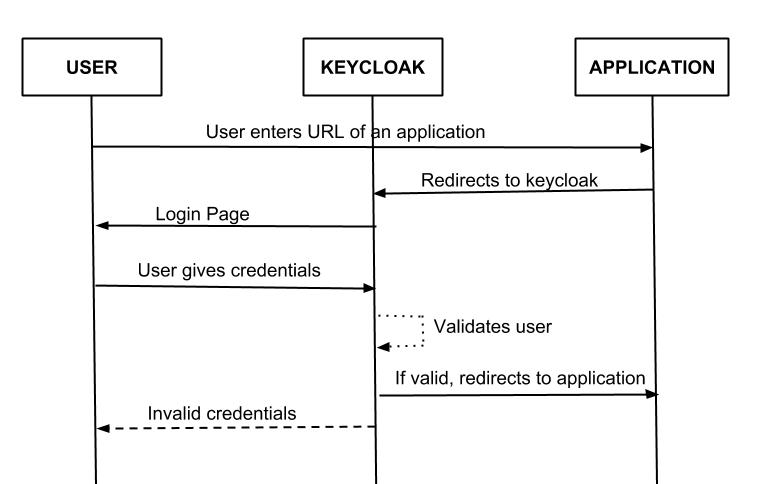

# springcloud-app-with-keycloack-auth

This project has the objective to present a sample for a simple appication that uses Keycloak as an identity server and authorization server. It will uses OAuth flows to authenticate an user for an application. In this sample I'll not get into OAuth 2.0 details. It is easy to find articles to explain OAuth 2.0 flows (here is a suggestion: https://connect2id.com/learn/oauth-2). To represent how Keycloak fits into this scenario it is ilustrated right below:


At the image above, our sample app represents the resource server, while the Keycloak represents the authorization server. Our user browser is the client application. Our application is going to use a client credentials authorization flow to authenticate our user and allow his access to our application endpoint. The flow is the one represented right below:



For the Keycloak service it is used a Docker image to represent the service (https://hub.docker.com/r/jboss/keycloak/). The application we want to represent is packed in a second Docker image just to make it easier to run the services. Unfortunately it was not created a Docker compose file because the application need some information that we only going to have after running the Keycloak service.

## The Keycloak service:

To run the Keycloak service in this example it was started with a docker command to have a admin user and password to create the basic configuration:

```CONSOLE
    docker run -e KEYCLOAK_USER=<USERNAME> -e KEYCLOAK_PASSWORD=<PASSWORD> -p 8080:8080 jboss/keycloak
```

After starting the service it is necessary to login into the Keycloak administration console and register a realm to create a security domain for our application (http://localhost:8080/auth/). The following video show the steps to create a Realm, a application client (according to the OAuth concept) and a application user:


When creating the application client to be used by the application:

- Create it as confidencial;
- Create it with no direct access;
- Save the URL used by your spring application when authenticating the user;
- Create the application user password with a value to remeber whem runing the application (in the sample it was used 123456).

## The Application configurations:

Some configurations are needed into the spring application.yml file to make the authentication mecanism works properly. Some values to be saved on this file must match values that were saved into the Keycloak configuration. Here follows some details that are important to configure and access your spring application:

- The application user was created with the password 123456;
- The client-id attribute must match the one registred into Keycloak;
- The client-secret attribute must match the one generated after creating the client on Keycloak;
- The redirect-uri attribute must match the one registred into Keycloak;
- The provider issuer-uri must follow the keycloak pattern using the name of the created Realm for the application.

To run the application (with Keycloak running and the configurations done) it is necessary to clone this project from github, build it with maven and run it as a springboot java application. Here follow the commands after cloning the project:

```CONSOLE
mvn clean package;
java -jar sample-auth-booking-app/target/sample-auth-booking-app-0.0.1-SNAPSHOT.jar
```

According to the presented video we can see that we try to reach a protected RESTful service before authenticating. The Spring application redirect the user to authenticate in Keycloak and returns the user after a sucessful authentication to the requested service. It was all done using the OAuth flows presented here.

## Finally:

- It is important to understant the concpets of authentication and authorization to not misunderstand those responsibilities in an application;
- It is easier to understand the application authentication mechanisms if you understand the OAuth flows, otherwise it is going to be hard to understand what the tool is doing;
- The usage of an Identify Server has serveral advantages for providing buit-in services, but Spring can provide features so you can build your onw;

## Content sources

 - https://www.devglan.com/spring-security/spring-boot-oauth2-jwt-example
 - https://connect2id.com/learn/oauth-2
 - https://spring.io/blog/2017/11/01/spring-security-5-0-0-rc1-released#password-encoding
 - https://dzone.com/articles/whats-better-oauth-access-tokens-or-json-web-token
 - https://projects.spring.io/spring-security-oauth/docs/oauth2.html
 - https://auth0.com/docs/api-auth/tutorials/password-grant
